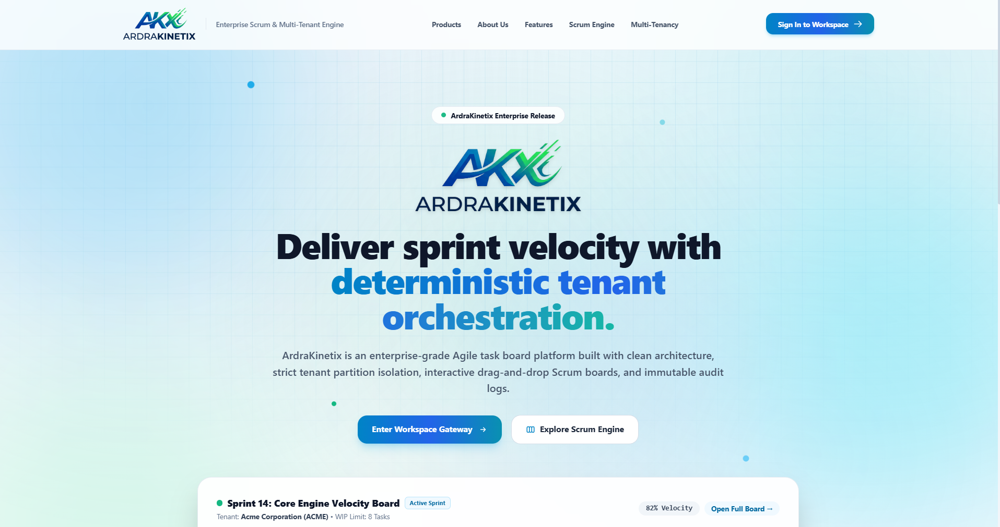
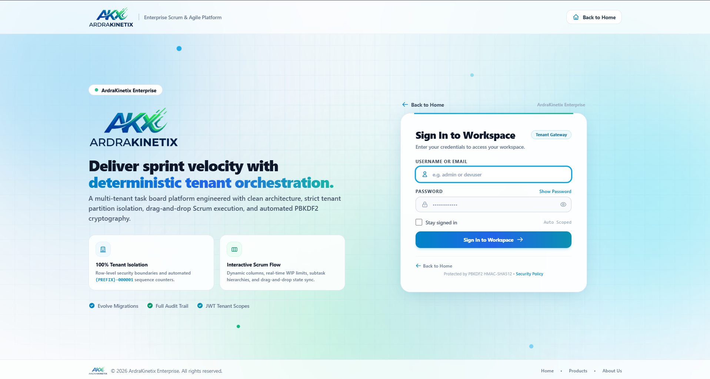
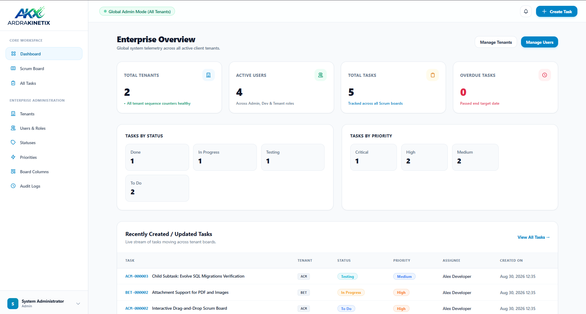

# TaskBoard (ArdraKinetix Enterprise)

[](https://dotnet.microsoft.com/)
[](https://learn.microsoft.com/dotnet/csharp/)
[](https://dotnet.microsoft.com/apps/aspnet)
[](https://www.microsoft.com/sql-server)
[](https://learn.microsoft.com/ef/core/)
[](https://tailwindcss.com/)
[](https://alpinejs.dev/)
[](https://dotnet.microsoft.com/apps/aspnet/signalr)
[](./LICENSE.txt)

An enterprise-grade, multi-tenant Agile Scrum and Kanban task board application engineered for high-velocity software engineering teams. Built with **.NET 10**, **Clean Architecture**, and deterministic tenant boundary isolation.

<p align="center">
  
</p>

---

## 📋 Table of Contents
- [Application Screenshots](#-application-screenshots)
- [Key Features](#-key-features)
- [Tech Stack](#-tech-stack)
- [Initial Login Credentials](#-initial-login-credentials)
- [Solution Architecture](#-solution-architecture)
- [Getting Started](#-getting-started)
  - [Prerequisites](#prerequisites)
  - [Database Setup & Configuration](#database-setup--configuration)
  - [Running the Application](#running-the-application)
  - [Running Tests](#running-tests)
- [Security & Multi-Tenancy](#-security--multi-tenancy)
- [License](#-license)

---

## 📸 Application Screenshots

### 🏠 Landing Page
Modern, responsive enterprise landing page showcasing platform capabilities, sprint orchestration, and architecture.

<p align="center">
  
</p>

### 🔐 Workspace Sign-In Portal
Secure multi-tenant authentication portal. Sign in using the [Initial Login Credentials](#-initial-login-credentials) with **Email** and **Password**.

<p align="center">
  
</p>

### 📊 Administrative Dashboard
System-wide administrative console displaying organization management, tenant telemetry, active users, and system governance metrics.

<p align="center">
  
</p>

---

## ✨ Key Features

- **Multi-Tenant Isolation**: Strict row-level data segregation by tenant ID across projects, tasks, sprints, and audit logs.
- **Interactive Kanban & Scrum Board**: Native HTML5 drag-and-drop task status mutations, subtask trees, and dynamic WIP limits.
- **Real-Time Collaboration**: Real-time board synchronization via ASP.NET Core SignalR websockets.
- **Enterprise Authentication & RBAC**: Dual JWT access token + secure HttpOnly cookies, 5-day rotating refresh tokens, and fine-grained role-based permissions (`Admin`, `Developer`, `TenantUser`).
- **Comprehensive Audit Trail**: Immutable logging of task transitions, tenant accesses, and administrative operations.
- **Automated Schema & Seed Migrations**: Versioned database migrations powered by Evolve SQL scripts executed on startup.

---

## 🛠️ Tech Stack

| Domain | Technology / Library | Description |
| :--- | :--- | :--- |
| **Framework & Runtime** | [.NET 10.0](https://dotnet.microsoft.com/) (C# 13) | Modern, high-performance cross-platform runtime |
| **Web Architecture** | [ASP.NET Core MVC](https://learn.microsoft.com/aspnet/core/mvc) | Model-View-Controller with Razor Views and Anti-Forgery token validation |
| **Software Architecture** | [Clean / Onion Architecture](https://blog.cleancoder.com/uncle-bob/2012/08/13/the-clean-architecture.html) | Strict layer decoupling: `Domain` &rarr; `Application` &rarr; `Infrastructure` &rarr; `Web` |
| **Database** | [Microsoft SQL Server](https://www.microsoft.com/sql-server) / LocalDB | Primary relational database engine |
| **ORM & Data Access** | [Entity Framework Core 10](https://learn.microsoft.com/ef/core/) & `Microsoft.Data.SqlClient` | Code-first data mapping, LINQ queries, and connection resilience |
| **Database Migrations** | [Evolve (v3.2.0)](https://evolve-db.netlify.app/) | Deterministic, file-based SQL migration scripts (`V1_0_0...sql`) |
| **Authentication & Tokens** | [System.IdentityModel.Tokens.Jwt](https://www.nuget.org/packages/System.IdentityModel.Tokens.Jwt) | JWT generation, validation, HttpOnly cookie middleware, and refresh token rotation |
| **Cryptography** | `PBKDF2 HMAC-SHA512` | High-iteration salted cryptographic password hashing |
| **Real-Time Engine** | [ASP.NET Core SignalR](https://learn.microsoft.com/aspnet/core/signalr) | Low-latency WebSockets hub for multi-client board coordination |
| **Validation** | [FluentValidation (v11.11.0)](https://fluentvalidation.net/) | Strongly-typed validation rules and automatic pipeline execution |
| **Styling & UI** | [Tailwind CSS](https://tailwindcss.com/) (Local runtime) | Modern responsive utility-first CSS design system |
| **Client Reactivity** | [Alpine.js](https://alpinejs.dev/) | Declarative, lightweight client-side reactivity |
| **Animation & Motion** | [GSAP (GreenSock)](https://gsap.com/) | High-performance interactive UI animations and transitions |
| **Testing Suite** | [xUnit](https://xunit.net/), [FluentAssertions](https://fluentassertions.com/), [Moq](https://github.com/moq/moq4) | Unit, domain, and end-to-end `WebApplicationFactory` integration tests |

---

## 🔐 Initial Login Credentials

> 🔑 **Sign-In Notice**: To log into the application portal, use the **Email** and **Password** credentials listed below.

| Full Name | Email | Password | Role | Organization / Scope |
| :--- | :--- | :--- | :--- | :--- |
| **System Administrator** | `admin@taskboard.local` | `AdminPassword123!` | `Admin` | System-wide Global Admin |
| **Alex Developer** | `developer@taskboard.local` | `Developer123!` | `Developer` | Multi-Tenant (*Acme Corp & Beta Dynamics*) |
| **Sarah Acme** | `tenantuser@acme.local` | `TenantUser123!` | `TenantUser` | Acme Corporation (`ACM`) |
| **David Beta** | `tenantuser@beta.local` | `TenantUser123!` | `TenantUser` | Beta Dynamics (`BET`) |

### Role Scope Breakdown:
- **`Admin`**: Global administrative control over all organizations, system settings, global audit logs, and user management.
- **`Developer`**: Cross-tenant engineering access spanning assigned organizations (Acme Corporation and Beta Dynamics) with task creation, assignment, and sprint execution privileges.
- **`TenantUser`**: Scoped strictly to the member's specific organization with row-level data access restrictions.

---

## 🏛️ Solution Architecture

The solution adheres strictly to **Clean Architecture** patterns:

```text
TaskBoard/
├── docs/
│   └── images/                       # Documentation and preview screenshots
│       ├── home-page.png
│       ├── login-page.png
│       └── admin-dashboard.png
│
├── src/
│   ├── TaskBoard.Domain/             # Enterprise domain entities, enums, exceptions & specifications
│   │   ├── Entities/                 # (User, Tenant, Organization, TaskItem, Sprint, AuditLog)
│   │   ├── Enums/                    # (TaskStatus, Priority, Role)
│   │   └── Interfaces/               # Core domain repository contracts
│   │
│   ├── TaskBoard.Application/          # Application business logic, use cases & services
│   │   ├── DTOs/                     # Data transfer objects
│   │   ├── Features/                 # Feature handlers (Auth, Tasks, Sprints, Users, Tenants)
│   │   ├── Security/                 # Current user context & encryption services
│   │   └── Validators/               # FluentValidation request validators
│   │
│   ├── TaskBoard.Infrastructure/       # External integrations, DB context & migrations
│   │   ├── Data/                     # ApplicationDbContext (EF Core)
│   │   ├── Migrations/Scripts/       # Versioned SQL migration scripts (Evolve)
│   │   ├── Realtime/                 # SignalR TaskBoardHub
│   │   └── Repositories/             # EF Core repository implementations
│   │
│   └── TaskBoard.Web/                  # Presentation layer (ASP.NET Core MVC)
│       ├── Controllers/              # MVC & API controllers
│       ├── Middleware/               # JWT Cookie, Exception handling & Tenant context
│       ├── Views/                    # Razor Views (Board, Tasks, Sprints, Dashboard, Admin)
│       └── wwwroot/                  # Static assets (Tailwind, Alpine.js, GSAP, CSS, JS)
│
└── tests/
    ├── TaskBoard.Domain.Tests/         # Domain entity & logic unit tests
    ├── TaskBoard.Application.Tests/    # Command & query handler unit tests
    ├── TaskBoard.Infrastructure.Tests/ # Data access & integration tests
    └── TaskBoard.Web.Tests/            # Full-stack WebApplicationFactory integration tests
```

---

## 🚀 Getting Started

### Prerequisites

Ensure you have the following installed on your machine:
- [.NET 10.0 SDK](https://dotnet.microsoft.com/download/dotnet/10.0) (`net10.0`)
- [SQL Server 2019+](https://www.microsoft.com/sql-server) or **LocalDB** (included with Visual Studio)
- [Git](https://git-scm.com/)

---

### Database Setup & Configuration

1. Clone the repository:
   ```bash
   git clone https://github.com/Devansh100ni/ArdraKinetix.git
   cd TaskBoard
   ```

2. Review or update the connection string in `src/TaskBoard.Web/appsettings.json`:
   ```json
   "ConnectionStrings": {
     "DefaultConnection": "Server=(localdb)\\mssqllocaldb;Database=TaskBoardDb;Trusted_Connection=True;MultipleActiveResultSets=true;TrustServerCertificate=True"
   }
   ```
   > 💡 **Automatic Migration**: When the application runs, **Evolve** will automatically detect your database, apply all migration scripts (`src/TaskBoard.Infrastructure/Migrations/Scripts/`), and seed the initial roles, tenants, and login accounts.

---

### Running the Application

Execute the following command to start the web application:

```bash
dotnet run --project src/TaskBoard.Web
```

Once started, navigate to:
- **Application URL**: `https://localhost:5001` or `http://localhost:5000`
- **Sign In Portal**: `/Account/Login`

Log in using any of the credentials provided in the [Initial Login Credentials](#-initial-login-credentials) section using **Email** and **Password**.

---

### Running Tests

Execute the comprehensive test suite across all layers:

```bash
dotnet test
```

---

## 🔒 Security & Multi-Tenancy

- **Password Storage**: Passwords are never stored in plaintext. Passwords use PBKDF2 HMAC-SHA512 hashing with 100,000+ iterations and per-user cryptographic salts.
- **Session Management**: Dual-token strategy with short-lived (30-minute) JWT access tokens transmitted via encrypted HttpOnly cookies or Authorization bearer headers, and persistent (5-day) secure refresh tokens with revocation tracking.
- **Tenant Isolation**: Every database entity inherits tenant ownership metadata, verified dynamically by `ICurrentUserService` and database query filters to guarantee strict cross-tenant isolation.
- **Cross-Site Request Forgery (CSRF)**: All state-modifying requests (`POST`, `PUT`, `DELETE`) are protected by automatic anti-forgery token validation (`AutoValidateAntiforgeryTokenAttribute`).

---

## 📄 License

This project is licensed under the MIT License — see the [LICENSE.txt](./LICENSE.txt) file for details.
